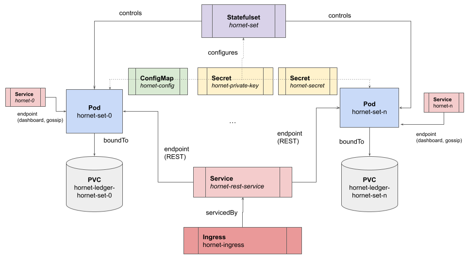

# How to run IOTA mainnet Hornet nodes on a Kubernetes environment

In this tutorial you will learn how to run [IOTA](https://wiki.iota.org/chrysalis-docs/welcome) mainnet [Hornet](https://wiki.iota.org/hornet/welcome) nodes on a Kubernetes (K8s) environment. [Kubernetes](https://kubernetes.io/docs/concepts/overview/what-is-kubernetes/) is a portable, extensible, open-source platform for managing containerized workloads and services, that facilitates both **declarative configuration** and automation. It has a large, rapidly growing ecosystem. K8s services, support and tools are widely available from multiple cloud providers.

If you are not familiar with K8s we recommend you to start by [learning the K8s technology](https://kubernetes.io/docs/tutorials/kubernetes-basics/).

## Introduction

Running Hornet mainnet nodes on K8s can enjoy all the advantages of a declarative, managed, portable and automated container-based environment. However, as Hornet is a stateful service with several persistence, configuration and peering requirements, the task can be challenging. To overcome it, the IOTA Foundation under the [one-click-tangle](https://github.com/iotaledger/one-click-tangle) repository umbrella is providing K8s recipes and associated scripts that intend to educate developers on how nodes can be automatically deployed, peered and load balanced in a portable way.

Furthermore, a ready to be used [script](https://github.com/iotaledger/one-click-tangle/blob/chrysalis/hornet-mainnet-k8s/hornet-k8s.sh) allows running sets of Hornet instances "in one click" in your K8s environment of choice, but also provides a blueprint with the best practices to be leveraged by K8s administrators when deploying production-ready environments.

## Deployment using the "one click" script

For running the [one click script](https://github.com/iotaledger/one-click-tangle/hornet-mainnet-k8s/README.md) you need to get access to a K8s cluster. For local development we recommend [microk8s](https://microk8s.io/).
In addition you need the [kubectl](https://kubernetes.io/docs/tasks/tools/) command line tool [properly configured](https://kubernetes.io/docs/reference/kubectl/overview/) to get access to your cluster.

The referred script accepts the following parameters (passed as variables on the command line):

* `NAMESPACE`: The namespace where the one-click script will create the K8s objects. `tangle` by default.
* `PEER`: A [multipeer address](https://wiki.iota.org/hornet/post_installation/peering#addressing-peer-neighbors) that will be used to peer your nodes with. If no address is provided, autopeering will be configured for the first Hornet Node (`hornet-0`) of the set.
* `INSTANCES`: The number of Hornet instances to be deployed. `1` by default.
* `INGRESS_CLASS`: The class associated to the [Ingress](https://kubernetes.io/docs/concepts/services-networking/ingress/) object that will be used to expose externally the Node API endpoint so that it can be load balanced. It can depend on the target K8s environment. `nginx` by default.

For deploying a Hornet Node using the default parameter values you just need to run:

```sh
hornet-k8s.sh deploy
```

After executing the script different Kubernetes objects will be created (under the `tangle` namespace) as enumerated and depicted below (you can see the `kubectl` instruction to get details about them):



* [Namespace](https://kubernetes.io/docs/concepts/overview/working-with-objects/namespaces/) where all the objects live, `tangle` by default.

```sh
kubectl get namespaces
```

```ascii
NAME              STATUS   AGE
default           Active   81d
tangle            Active   144m
kube-node-lease   Active   81d
kube-public       Active   81d
kube-system       Active   81d
```

* A [StatefulSet](https://kubernetes.io/docs/concepts/workloads/controllers/statefulset/) (named `hornet-set`) that controls the different Hornet instances and enables scaling them.

```sh
 kubectl get statefulset -n tangle -o=wide
```

```ascii
NAME         READY   AGE   CONTAINERS   IMAGES
hornet-set   1/1     20h   hornet       gohornet/hornet:1.1.3
```

* One [Pod](https://kubernetes.io/docs/concepts/workloads/pods/) per Hornet Node bound to our StatefulSet. A pod is actually an artefact that executes the Hornet Docker container.

```sh
kubectl get pods -n tangle
```

```ascii
NAME           READY   STATUS    RESTARTS   AGE
hornet-set-0   1/1     Running   0          20h
```

You may have noticed that the name of the pod is the concatenation of the name of the Statefulset `hornet-set` plus an index indicating the pod number in the set (in our case `0`). If we scaled our StatefulSet to `2` then we would have two pods (`hornet-set-0` and `hornet-set-1`).

* One [Persistent Volume Claim](https://kubernetes.io/docs/concepts/storage/persistent-volumes/) bound to each instance of the StatefulSet. It is used to store permanently all the files corresponding to the internal databases and snapshots of a Hornet Node.

```sh
kubectl get pvc -n tangle -o=wide
```

```ascii
NAME                         STATUS   VOLUME                                     CAPACITY   ACCESS MODES   STORAGECLASS   AGE
hornet-ledger-hornet-set-0   Bound    pvc-905fe9c7-6a10-4b29-a9fd-a405fd49a5fd   20Gi       RWO            standard       157m
```

You can observe that the name of the Persistent Volume Claim is the concatenation of `hornet-ledger` plus the name of the bound Pod `hornet-set-0` in our case.

* [Service](https://kubernetes.io/es/docs/concepts/services-networking/service/) objects:
  * One Service Node Port object which exposes the REST API of the nodes. It is actually a load balancer to port `14625` of **all** the Nodes.
  * One Service Node Port object **per Hornet instance** (in our example just one) which exposes as a "Node Port" the gossip, dashboard and autopeering endpoints.

```sh
kubectl get services -n tangle -o=wide
```

```ascii
NAME          TYPE       CLUSTER-IP     EXTERNAL-IP   PORT(S)                                          AGE   SELECTOR
hornet-0      NodePort   10.60.4.75     <none>        15600:30744/TCP,8081:30132/TCP,14626:32083/UDP   19h   statefulset.kubernetes.io/pod-name=hornet-set-0
hornet-rest   NodePort   10.60.3.96     <none>        14265:31480/TCP                                  19h   app=hornet
```

Additionally, you can run  `kubectl describe services -n tangle` to get more details about the endpoints supporting the referred Services.

Note: The name of the Services is important as will allow to address Hornet Nodes by DNS name *within the cluster*. For instance, if you want to peer a Hornet Node within the cluster you can refer to it with the name of its bound Service, for instance, `hornet-0`.

* An [Ingress](https://kubernetes.io/docs/concepts/services-networking/ingress-controllers/) controller intended to expose the load-balanced Hornet REST API endpoint outside the cluster, under the `/api` path. For convenience also the dashboard corresponding to the first Hornet in the StatefulSet (`hornet-0`) is also exposed through the `/` path.

```sh
kubectl get ingress -n tangle -o=wide
```

```ascii
NAME             CLASS    HOSTS   ADDRESS        PORTS   AGE
hornet-ingress   <none>   *       34.120.54.67   80      21h
```

In the example above you can observe that public IP address of the load balancer associated to the Ingress Controller is shown. This will actually happen when you are deploying on a commercial public cloud service.  

* A [ConfigMap](https://kubernetes.io/docs/concepts/configuration/configmap/) that contains the configuration applied to each Hornet Node, including the peering configuration. (Remember that our Hornet nodes, that belong to an StatefulSet, are peered among them).

```sh
kubectl get configmap -n tangle -o=wide
```

```ascii
NAME               DATA   AGE
hornet-config      4      19h
kube-root-ca.crt   1      19h
```

Likewise, `kubectl describe configmap hornet-config` can be run to obtain more details about such ConfigMap.

* [Secrets](https://kubernetes.io/docs/concepts/configuration/secret/) of the Nodes (keys, etc.). Two secrets are created:

  * `hornet-secret` which contains secrets related to the dashboard credentials (hash and salt).
  * `hornet-private-key` contains the Ed25519 private keys of each node.

```sh
kubectl get secrets -n tangle -o=wide
```

```ascii
NAME                  TYPE                                  DATA   AGE
default-token-fks6m   kubernetes.io/service-account-token   3      20h
hornet-private-key    Opaque                                1      20h
hornet-secret         Opaque                                2      20h
```

Note: Network Policies are not provided by this blueprint but in a real production environment they should be defined, so that Pods are properly restricted to perform outbound connections or receive inbound connections.

### Getting access to your Hornet Node

Once your Hornet Node has been deployed on the cluster you would want to get access to it from the outside. Fortunately that is easy as we have already created [K8s Services of type Node Port](https://kubernetes.io/docs/concepts/services-networking/service/#type-nodeport). It essentially means that your Hornet Node will be accessible through certain ports published on the K8s machine (worker node in K8s terminology) where Hornet is actually running.

If you execute:

```sh
kubectl get services -n tangle
```

```ascii
hornet-0      NodePort   10.60.4.75     <none>        15600:30744/TCP,8081:30132/TCP,14626:32083/UDP   20h
hornet-rest   NodePort   10.60.3.96     <none>        14265:31480/TCP                                  20h
```

In the example above the REST API endpoint of your Hornet Node will be accessible through the port `31480` of a K8s worker. Likewise, the Hornet dashboard will be exposed on the port `30744`.

If you are running microk8s locally in your machine you will typically have only one K8s machine running as a virtual machine in your desktop or laptop. Usually the IP address of such a virtual machine is `192.168.64.2`. Nonetheless you can double check such IP address by displaying your 
current kubectl configuration:

```sh
kubectl config view | grep server
```

and you will get an output similar to (that will correspond to the endpoint of the [K8s API Server](https://kubernetes.io/docs/reference/command-line-tools-reference/kube-apiserver/).

```ascii
server: https://192.168.64.2:16443
```

Additionally you can get access to your Hornet Node REST API endpoint through the external load balancer defined by the Ingress Controller. In the case of a local configuration this does not make so much a difference as the machine where the Ingress Controller lives is just the same as the Service machine. However in the case of a real environment provided by a public cloud provider your Ingress controller will be usually mapped to a load balancer exposed through a public IP address. You can find more information below when we talk about specifics of commercial public cloud environments.

*Remember that it might take a while for your Hornet Pods to be running and ready*

### Working with multiple instances

If you want to work with multiple instances you can scale your current K8s StatefulSet by running:

```sh
INSTANCES=2 hornet-k8s.sh scale
```

If the cluster has enough resources, automatically a new Hornet Node will be spawned and peered with your original one.

You will notice that one more Pod (`hornet-set-1`) will be running:

```sh
kubectl get pods -n tangle -o=wide
```

```ascii
NAME           READY   STATUS    RESTARTS   AGE
hornet-set-0   1/1     Running   0          24h
hornet-set-1   1/1     Running   0          24h
```

and a new Persistent Volume

```sh
kubectl get pvc -n tangle -o=wide
```

```ascii
hornet-ledger-hornet-set-0   Bound    pvc-905fe9c7-6a10-4b29-a9fd-a405fd49a5fd   20Gi       RWO            standard       24h
hornet-ledger-hornet-set-1   Bound    pvc-95b3b566-4602-4a36-8b1b-5e6bf75e5c6f   20Gi       RWO            standard       24h
```

and an additional Service `hornet-1`.

```sh
kubectl get services -n tangle -o=wide
```

```ascii
NAME          TYPE       CLUSTER-IP     EXTERNAL-IP   PORT(S)                                          AGE   
hornet-0      NodePort   10.60.4.75     <none>        15600:30744/TCP,8081:30132/TCP,14626:32083/UDP   24h   
hornet-1      NodePort   10.60.7.44     <none>        15600:32184/TCP,8081:31776/TCP,14626:31729/UDP   24h   
hornet-rest   NodePort   10.60.3.96     <none>        14265:31480/TCP                                  24h
```

The REST service now will be load balancing two Pods as you can check out yourself:

```sh
kubectl describe services/hornet-rest -n tangle 
```

```ascii
Name:                     hornet-rest
Namespace:                tangle
Labels:                   app=hornet-api
                          source=one-click-tangle
Selector:                 app=hornet
Type:                     NodePort
IP Family Policy:         SingleStack
IP Families:              IPv4
IP:                       10.60.3.96
IPs:                      10.60.3.96
Port:                     rest  14265/TCP
TargetPort:               14265/TCP
NodePort:                 rest  31480/TCP
Endpoints:                10.56.0.18:14265,10.56.9.32:14265
Session Affinity:         None
External Traffic Policy:  Cluster
```

And last but not least, if your `hornet-0` node is synced, `hornet-1` should also be synced as `hornet-0` and `hornet-1` will be peered between them. You can check it out by connecting to the corresponding dashboards.

## Deep dive. The "one-click" script internals

In this section of the tutorial you will learn the internals of our blueprints for deploying Hornet Nodes on K8s. The figure below depicts the target deployment architecture behind our proposed blueprint.


The figure presented before shows the formerly described K8s objects used and their relationships. Now we are going to give more details about them and what are the K8s manifests that declare them, all of them available at the [repository](https://github.com/iotaledger/one-click-tangle/tree/chrysalis/hornet-mainnet-k8s). The label `source=one-click-tangle` is generally used to mark these K8s objects that will live under a specific Namespace (named `tangle` by default).

### StatefulSet `hornet-set`

`hornet.yaml` source file contains the definition of the StatefulSet (`hornet-set`) that templates and controls the execution of the Hornet Pods. The StatefulSet also is bound to a `volumeClaimTemplate` so that each Hornet Node on the set can be bound to its own K8s Persistent Volume. Such StatefulSet is labelled as `source=one-click-tangle` and the selector used for the Pods is `app=hornet`. In addition the StatefulSet is bound to the Service `hornet-rest`. More details about Services are given later.

The template contains the Pod definition which declares different volumes:

* `configuration` which is mapped to the `hornet-config` ConfigMap.
* `private-key` which is mapped to the `hornet-private-key` Secret.
* `secrets-volume` an `emptyDir` internal volume where the Hornet Node private key will be actually copied.

The Pod definition within the StatefulSet contains one initialization container (`create-volumes`) and one regular container (`hornet`). The initialization container is in charge of preparing the corresponding volumes so that the `hornet` container volume mounts are ready to be used with the proper files inside and suitable permissions. In fact, the initialization container copies the Hornet Node private key and peering configuration so that each Hornet is bound to its own private key and peering details.

The `hornet` container declares the following volume mounts which are key to make the `hornet` container run properly within its Pod:

* `/app/config.json` against the `configuration` volume. 
* `app/p2p2store` against the `p2pstore` subfolder of the `hornet-ledger` Persistent Volume.
* `app/p2pstore/identity.key` against the transient, internal `secrets-volume` of the Pod.
* `app/peering.json` against the `peering` subfolder of the `hornet-ledger` Persistent Volume. Please note that this is necessary as the peering configuration is dynamic and new peers might be added during the lifecycle of the Hornet Node.
* `app/mainnetdb` against the `mainnetdb` subfolder of the  `hornet-ledger` Persistent Volume (to store the database files).
* `app/snapshots/mainnet` against the `snapshots` subfolder of the `hornet-ledger` Persistent Volume (to store snapshots).

Apart from that, the Pod template configuration declares extra configuration details such as `liveness` and `readiness` probes, security contexts, and links to other resources such as the Secret that defines the dashboard credentials (actually mapped into environment variables).  

### Services

There are two different kind of Services used in our blueprint:

* A Node Port Service `hornet-rest` (declared by the `hornet-rest-service.yaml` manifest) that is just bound to the StatefulSet and to the port `14265` of the Hornet Nodes. Its purpose is to enable exposing the REST API endpoint of the Hornet nodes. The endpoint Pods of such a Service are those labeled as `app=hornet`.

* One Node Port Service (`hornet-0`, `hornet-1`, ..., `hornet-n`) per Hornet Node, declared by the `hornet-service.yaml` manifest. These Node Port Services are intended to expose access to the individual dashboard, gossip and autopeering endpoints of each node. Thus, it is *only bound to one and only one Hornet Node*. For this purpose its configuration includes `externalTrafficPolicy` `local` and a selector named `statefulset.kubernetes.io/pod-name: hornet-set-x` where `x` corresponds to the Pod number of the Hornet Node the Service is bound to. Under the hood the one-click script takes care of creating as many Services of this type as needed.

### Ingress Controller `hornet-ingress`

The Ingress Controller `hornet-ingress` is configured so that the `hornet-rest` Service can be externally load balanced. There are two path mappings, `/api` which backend is the  `hornet-rest` Service and `/` which backend is the dashboard of the `hornet-0` Service. The latter is just for convenience reasons of this blueprint. In the default configuration the `kubernetes.io/ingress.class` is `nginx` but that can be overridden for specific cloud environments (see below).

### ConfigMap and Secrets

For ConfigMaps and Secrets there are no YAML definition files as they are created on the fly through the `kubectl` command line.
Actually they are created from a `config` directory that is automatically generated by the "one click" script. You can see the contents of those objects by running

```sh
kubectl get configmap/hornet-config -n tangle -o=yaml
```

The same for credentials of the Hornet dashboard (all the nodes share the same admin credentials)

```sh
kubectl get secrets/hornet-secret -n tangle -o=yaml
```

and for the Nodes' private keys:

```sh
kubectl get secrets/hornet-private-key -n tangle -o=yaml
```

## Google Kubernetes environment (GKE) specifics

Our deployment recipes are fully portable to the GKE cloud commercial environment. The only custom step is to
ensure that the Ingress Controller is properly annotated with `kubernetes.io/ingress.class: gce`. You can do that by just executing

```sh
kubectl annotate -f hornet-ingress.yaml -n $NAMESPACE --overwrite kubernetes.io/ingress.class=gce
```

Alternatively if you are using the "one click" script you can just execute

```sh
INGRESS_CLASS=gce hornet-k8s.sh deploy
```

and the one click script will perform the annotation during the deployment process.

*Remember that the process of deploying an external load balancer by a public cloud provider can take a while.*

On the other hand to get access to the Service Node Ports you would need to have a cluster with public K8s workers. You can know the public IP addresses of your K8s workers by running:

```sh
kubectl get nodes -o=wide
```

Then, you can know on which K8s worker your Hornet Pod is running by executing (`NAMESPACE` by default would be `tangle`):

```sh
kubectl get pods -n $NAMESPACE -o=wide
```

Once you know the worker and its IP address you can get access to each individual Hornet Node by knowing the Node ports declared by the corresponding service. And remember you can do it by running:

```sh
kubectl get services -n $NAMESPACE
```

Once you know the port you have to create firewall rules so that such port is reachable. That can be done using the [gcloud](https://cloud.google.com/sdk/docs/install) tool. For instance, if our Hornet Node's dashboard is mapped to port `34200`:

```sh
gcloud compute firewall-rules create test-hornet-dashboard --allow tcp:34200
```

Afterwards we can open up a browser and load `http://IP_ADDR_OF_MY_WORKER:34200` to get access to the Hornet Node's dashboard.

## Amazon Kubernetes environment (EKS) specifics

Our deployment recipes are fully portable to the EKS commercial environment. However there are certain steps that have to be taken on your cluster so that the Ingress Controller is properly managed to an AWS Application Load Balancer (ALB).

* You need to
* Then you need to annotate your Ingress Controller with
* And finally with

## Conclusions

The availability of reference recipes is key to facilitate the deployment of IOTA mainnet Hornet nodes. The IOTA Foundation provides them as a blueprint that can be customised by developers and administrators in their journey towards a production-ready deployment. The reference recipes have been designed with portability and simplicity in mind and tested successfully on some popular commercial public cloud environments.
